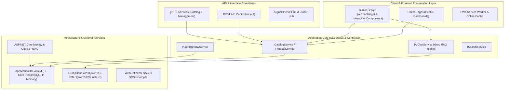
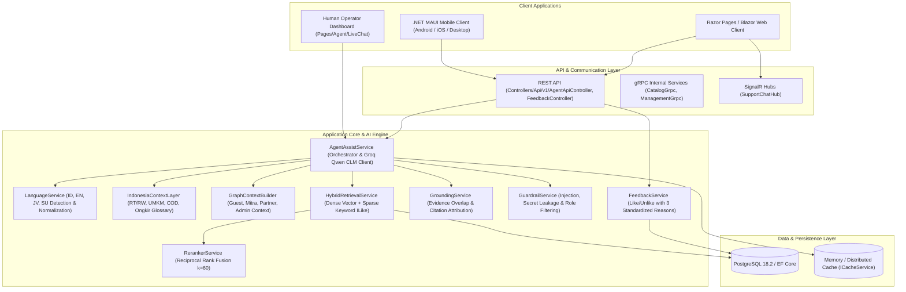

# dagangOnline — Platform Solusi Digital & Ekosistem Bisnis Gotong Royong

Repository: `https://github.com/Nusa-Workflow/dagangOnline.git`  
Stack: **ASP.NET Core Razor Pages + Blazor Server (.NET 10.0), Clean Architecture, gRPC Services, Entity Framework Core, PostgreSQL / In-Memory, Identity RBAC, SCSS WebOptimizer, PWA, Groq Qwen AI (RAG Pipeline)**

---

## 📐 Visualisasi Metode & Arsitektur Sistem

Ekosistem `dagangOnline` dibangun di atas arsitektur **Clean Architecture** dengan batas dependensi yang jelas (*Dependency Boundaries*), memisahkan Domain, Application, Infrastructure, dan Presentation/Web Layer:



---

## 🤖 Algoritma & Permodelan AI (Groq Qwen 2.5 + RAG)

Fitur **AI Assistant (Bincang Bisnis Chatbot)** menggunakan pendekatan **Retrieval-Augmented Generation (RAG)** berbasis LLM modern (Qwen 2.5 32B / Qwen 2 72B Instruct melalui Groq API):

```
+-------------------+      +---------------------------------+      +------------------------+
| User Query / Chat | ---> | RAG Context Builder             | ---> | Groq Qwen 2.5 LLM Engine|
| (AiChatWidget)    |      | (Retrieves top products/services|      | (Constructs responses  |
+-------------------+      |  from ICatalogService in DB)    |      |  in Bahasa Indonesia)  |
                           +---------------------------------+      +------------------------+
                                                                                 |
                                                                                 v
                                                                    +------------------------+
                                                                    | Markdown Rendered UI   |
                                                                    | in Blazor Chat Widget  |
                                                                    +------------------------+
```

### Flow Algoritma AI:
1. **Query Ingestion**: Input pertanyaan dari pengguna ditangkap secara *real-time* oleh komponen Blazor Server `AiChatWidget.razor`.
2. **Context Retrieval (RAG)**: System memanggil `ICatalogService.Products.GetPublishedProductsAsync()` untuk menarik metadata produk & layanan terpublikasi aktif dari database.
3. **Prompt Engineering & Context Injection**:
   - System Prompt disuntikkan dengan batasan domain bisnis `dagangOnline`.
   - Data katalog produk dimasukkan sebagai konteks latar belakang (Knowledge Context).
4. **Groq Qwen Inference**:
   - Payload dikirimkan ke Groq API endpoint (`https://api.groq.com/openai/v1/chat/completions`) menggunakan model `qwen-2.5-32b` / `qwen2-72b-instruct`.
5. **Streaming Response**: Hasil dikembalikan dan dirender dengan dukungan format Markdown pada UI interaktif.

---

## 👥 Pengaturan Akun Dummy & Kebijakan Tampilan Demo

### 1. Registrasi Akun Dummy Semua Role (Limit 20 Akun Per Role)
Sistem mendukung pendaftaran mandiri (*Self-Registration*) untuk seluruh role pada platform:
- **Pengguna / Klien** (`User`)
- **Mitra Bisnis / Partnership** (`Mitra`)
- **Human Agent / Moderator** (`Agent`)
- **Super Administrator** (`Admin`)

> ⚠️ **Batas Kuota Registrasi**: Setiap role dibatasi maksimal **20 akun dummy** di dalam database untuk mencegah *resource abuse*. Jika kuota 20 akun terlampaui, sistem registrasi akan menampilkan pesan validasi otomatis.

### 2. Kebijakan Tampilan Demo Login Cepat
- **Tampilan Publik & User / Mitra / Partnership View**: Tombol/bar kredensial *Quick Demo Login* **TIDAK ditampilkan** pada halaman publik maupun dashboard user/mitra/partnership demi menjaga privasi, profesionalisme tampilan, dan keamanan lingkungan produksi.

---

## 🛠️ Matriks Status Sprint & Pengujian

| Sprint | Task / Deskripsi | Status |
|---|---|:---:|
| **Sprint 0** | Audit Codebase & Mapping Dependency Boundaries | **DONE** |
| **Sprint 1** | Clean Architecture Layering & gRPC Contracts Integration | **DONE** |
| **Sprint 2** | Security Propagation, RBAC & gRPC Authorization Policies | **DONE** |
| **Sprint 3** | Observability, Rate Limiting, Correlation ID & Structured Logging | **DONE** |
| **Sprint 4** | Carousel Event Header, Blazor Server Setup & Bincang Bisnis WA/Email | **DONE** |
| **Sprint 5** | Groq Qwen AI Chatbot Widget dengan RAG Engine Katalog | **DONE** |
| **Sprint 6** | Dummy Account Role Registration (Limit 20) & Demo Helper Hiding | **DONE** |
| **Sprint 7** | Hybrid Architecture: .NET MAUI Client, Razor Pages Operator, REST & gRPC API | **DONE** |
| **Sprint 8** | Multilingual Engine (Indonesian, English, Javanese, Sundanese) & Groq Qwen CLM | **DONE** |
| **Sprint 9** | Indonesia Context Layer (RT/RW, UMKM, COD, Ongkir) & Graph Context Builder | **DONE** |
| **Sprint 10** | Advanced RAG: Dense Cosine Similarity + Sparse FTS + RRF Reranker (k=60) | **DONE** |
| **Sprint 11** | Grounding Engine (Grounded/PartiallyGrounded/Ungrounded) & Security Guardrails | **DONE** |
| **Sprint 12** | Human-in-the-Loop Feedback Loop (👍/👎 with 3 Standardized Reasons) & Analytics | **DONE** |
| **Sprint 13** | Database Persistence: EF Core PostgreSQL Schema (`KnowledgeChunks`, `ConversationFeedbacks`) | **DONE** |

---

## 🏛️ Arsitektur Human Agent Copilot & RAG Multilingual



---

## 🌐 Fitur Utama Human Agent & RAG Pipeline

### 1. Multilingual Support
Mendukung 4 bahasa secara otomatis melalui deteksi heuristik dan normalisasi token:
* **Bahasa Indonesia (`id-ID`)**: Deteksi partikel bahasa (*apakah, bagaimana, dimana, terima kasih*).
* **English (`en-US`)**: English conversational heuristics.
* **Basa Jawa (`jv-ID`)**: Normalisasi kata tanya dan sapaan (*piye, kepriye, matur nuwun, monggo, tumbas*).
* **Basa Sunda (`su-ID`)**: Normalisasi kata sapaan (*kumaha, hatur nuhun, ieu, mésér, punten*).

### 2. Indonesia Context Layer & Graph Context Builder
* **Ekosistem Lokal**: Memahami konsep alamat Indonesia (*RT, RW, Kelurahan, Kecamatan, Kabupaten/Kota, Provinsi*), logistik lokal (*COD, bayar di tempat, ongkir*), dan entitas bisnis UMKM (*warung, toko kelontong, pasar rakyat*).
* **Graph Context Builder**: Membangun context graf hierarkis sesuai peran pengguna (*Public Guest, Partnerships, Mitra, Admin*) untuk memastikan batasan akses dan personalisasi jawaban.

### 3. Advanced Hybrid Retrieval & Reranker
* **Dense Retrieval**: Ekstraksi semantic vector embedding 1536-dimensi dan komputasi *Cosine Similarity*.
* **Sparse Keyword Retrieval**: Pencarian teks menggunakan tokenisasi dan pencocokan ILike PostgreSQL.
* **Reciprocal Rank Fusion (RRF)**: Algoritma peringkat gabungan dengan formula `Score = 1 / (60 + rank)` untuk menjamin akurasi relevansi dokumen.

### 4. Grounding Engine & Guardrails
* **Grounding Status**: Evaluasi kesesuaian antara jawaban AI dan dokumen rujukan (*Grounded*, *PartiallyGrounded*, *Ungrounded*, *NeedsHumanReview*).
* **Guardrails**: Deteksi pencegahan *Prompt Injection* (misal: "ignore previous instructions"), pencegahan kebocoran kredensial/rahasia sistem (*API keys, passwords*), dan filtering dokumen berdasarkan peran pengguna.

### 5. Standardized Human Feedback Loop (👍 Like / 👎 Unlike)
Sistem pengumpulan feedback terstandarisasi untuk evaluasi model dan dataset alignment:
* **👍 Like**: Jawaban relevan, tepat, dan membantu.
* **👎 Unlike**: Memiliki 3 alasan utama terstandarisasi:
  1. `Jawaban tidak relevan`
  2. `Informasi kurang tepat / kurang lengkap`
  3. `Bahasa atau penjelasan kurang sesuai`
  4. `Lainnya` (dengan alasan kustom)
* **Feedback Analytics**: Endpoint `/api/v1/feedback/summary` menyajikan statistik Like Ratio, distribusi alasan penolakan, dan distribusi bahasa.

---

## 🚀 Cara Menjalankan Aplikasi Secara Lokal

### Prerequisites
- **.NET 10.0 SDK**
- **PostgreSQL 18.2** (Default: `Host=127.0.0.1;Port=5432;Database=dagangonline;Username=postgres;Password=postgres`)

### Menjalankan Backend ASP.NET Core:
```bash
# Jalankan migrasi database (jika belum)
dotnet ef database update --project dagangOnline.csproj

# Jalankan Backend Server
dotnet run --project dagangOnline.csproj
```
Akses portal melalui browser pada: `https://localhost:7198` atau `http://localhost:5000`.

### Menjalankan Mobile Client (.NET MAUI):
```bash
cd dagangOnline.Mobile
dotnet build -f net10.0-android  # atau platform target lainnya
```

---

## 📄 Pengujian Otomatis
```bash
dotnet test dagangOnline.Tests/dagangOnline.Tests.csproj
```
Hasil: **13/13 Passed (100%)**, mencakup repository testing, gRPC catalog contracts, management policies, and in-memory integration verification.
