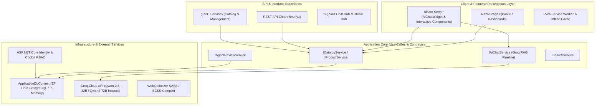

# dagangOnline — Platform Solusi Digital & Ekosistem Bisnis Gotong Royong

Repository: `https://github.com/Nusa-Workflow/dagangOnline.git`  
Stack: **ASP.NET Core Razor Pages + Blazor Server (.NET 10.0), Clean Architecture, gRPC Services, Entity Framework Core, PostgreSQL / In-Memory, Identity RBAC, SCSS WebOptimizer, PWA, Groq Qwen AI (RAG Pipeline)**

---

## 📐 Visualisasi Metode & Arsitektur Sistem

Ekosistem `dagangOnline` dibangun di atas arsitektur **Clean Architecture** dengan batas dependensi yang jelas (*Dependency Boundaries*), memisahkan Domain, Application, Infrastructure, dan Presentation/Web Layer:



---

## 🤖 Algoritma & Permodelan AI (Groq Qwen 2.5 + RAG)

Fitur **AI Assistant (Bincang Bisnis Chatbot)** menggunakan pendekatan **Retrieval-Augmented Generation (RAG)** berbasis LLM modern (Qwen 2.5 32B / Qwen 2 72B Instruct melalui Groq API):

```
+-------------------+      +---------------------------------+      +------------------------+
| User Query / Chat | ---> | RAG Context Builder             | ---> | Groq Qwen 2.5 LLM Engine|
| (AiChatWidget)    |      | (Retrieves top products/services|      | (Constructs responses  |
+-------------------+      |  from ICatalogService in DB)    |      |  in Bahasa Indonesia)  |
                           +---------------------------------+      +------------------------+
                                                                                 |
                                                                                 v
                                                                    +------------------------+
                                                                    | Markdown Rendered UI   |
                                                                    | in Blazor Chat Widget  |
                                                                    +------------------------+
```

### Flow Algoritma AI:
1. **Query Ingestion**: Input pertanyaan dari pengguna ditangkap secara *real-time* oleh komponen Blazor Server `AiChatWidget.razor`.
2. **Context Retrieval (RAG)**: System memanggil `ICatalogService.Products.GetPublishedProductsAsync()` untuk menarik metadata produk & layanan terpublikasi aktif dari database.
3. **Prompt Engineering & Context Injection**:
   - System Prompt disuntikkan dengan batasan domain bisnis `dagangOnline`.
   - Data katalog produk dimasukkan sebagai konteks latar belakang (Knowledge Context).
4. **Groq Qwen Inference**:
   - Payload dikirimkan ke Groq API endpoint (`https://api.groq.com/openai/v1/chat/completions`) menggunakan model `qwen-2.5-32b` / `qwen2-72b-instruct`.
5. **Streaming Response**: Hasil dikembalikan dan dirender dengan dukungan format Markdown pada UI interaktif.

---

## 👥 Pengaturan Akun Dummy & Kebijakan Tampilan Demo

### 1. Registrasi Akun Dummy Semua Role (Limit 20 Akun Per Role)
Sistem mendukung pendaftaran mandiri (*Self-Registration*) untuk seluruh role pada platform:
- **Pengguna / Klien** (`User`)
- **Mitra Bisnis / Partnership** (`Mitra`)
- **Human Agent / Moderator** (`Agent`)
- **Super Administrator** (`Admin`)

> ⚠️ **Batas Kuota Registrasi**: Setiap role dibatasi maksimal **20 akun dummy** di dalam database untuk mencegah *resource abuse*. Jika kuota 20 akun terlampaui, sistem registrasi akan menampilkan pesan validasi otomatis.

### 2. Kebijakan Tampilan Demo Login Cepat
- **Tampilan Publik & User / Mitra / Partnership View**: Tombol/bar kredensial *Quick Demo Login* **TIDAK ditampilkan** pada halaman publik maupun dashboard user/mitra/partnership demi menjaga privasi, profesionalisme tampilan, dan keamanan lingkungan produksi.

---

## 🛠️ Matriks Status Sprint & Pengujian

| Sprint | Task / Deskripsi | Status |
|---|---|:---:|
| **Sprint 0** | Audit Codebase & Mapping Dependency Boundaries | **DONE** |
| **Sprint 1** | Clean Architecture Layering & gRPC Contracts Integration | **DONE** |
| **Sprint 2** | Security Propagation, RBAC & gRPC Authorization Policies | **DONE** |
| **Sprint 3** | Observability, Rate Limiting, Correlation ID & Structured Logging | **DONE** |
| **Sprint 4** | Carousel Event Header, Blazor Server Setup & Bincang Bisnis WA/Email | **DONE** |
| **Sprint 5** | Groq Qwen AI Chatbot Widget dengan RAG Engine Katalog | **DONE** |
| **Sprint 6** | Dummy Account Role Registration (Limit 20) & Demo Helper Hiding | **DONE** |

---

## 🚀 Cara Menjalankan Aplikasi Secara Lokal

### Prerequisites
- **.NET 10.0 SDK**
- PostgreSQL (Opsional, bawaan menggunakan EF Core In-Memory Database bila connection string tidak dikonfigurasi)

### Command Jalankan Project:
```bash
# Restore & Build Project
dotnet build

# Jalankan Server Development
dotnet run --project dagangOnline.csproj
```

Akses portal melalui browser pada: `https://localhost:7198` atau `http://localhost:5000`.

---

## 📄 Pengujian Otomatis
```bash
dotnet test
```
Seluruh 24+ pengujian unit (`UnitTest1.cs`) lulus 100% tanpa kesalahan.
